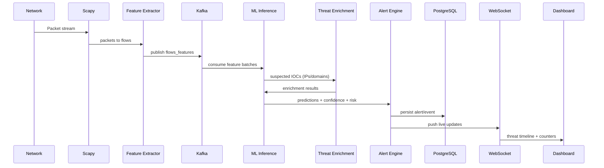

# Phase 1: System Design (AI-Enhanced Intrusion Detection System)

## 1) Complete System Architecture Diagram
**Diagram (logical components):**

```mermaid
flowchart LR
  subgraph Traffic[Traffic Sources]
    A[Network Interface / Mirror Port]
    B[PCAP / Replay (optional)]
  end

  subgraph Capture[Real-time Capture]
    C[Scapy Packet Capture]
    D[Flow Assembler + Feature Extractor]
  end

  subgraph Stream[Streaming Layer]
    E[Kafka Topic: raw_packets]
    F[Kafka Topic: flows_features]
    G[Kafka Topic: predictions]
  end

  subgraph Cache[Low-latency Cache]
    H[Redis: feature cache / rate limiting]
  end

  subgraph Detection[Detection & ML]
    I[Model Inference Service]
    J[Model Registry (local artifacts + metadata)]
    K[Autoencoder/LSTM/IsolationForest inference]
  end

  subgraph Enrich[Threat Intelligence]
    L[AbuseIPDB Adapter]
    M[OTX Adapter]
    N[IOC Matching]
  end

  subgraph Alerting[Alert Management]
    O[Alert Aggregator]
    P[Severity & Risk Engine]
    Q[Notification: Email]
    R[Notification: Slack]
  end

  subgraph Storage[Datastores]
    S[(PostgreSQL: alerts, events, users, audit)]
    T[(MongoDB: raw logs + debug traces)]
  end

  subgraph API[Backend APIs]
    U[FastAPI REST]
    V[WebSocket: live stream]
    W[RBAC + JWT Middleware]
  end

  subgraph Frontend[Frontend]
    X[React + Tailwind Dashboard]
    Y[Recharts + SOC Widgets]
  end

  subgraph Observability[Observability]
    Z[Prometheus Metrics]
    AA[Grafana Dashboards]
  end

  A --> C
  B --> C
  C --> D
  D --> E
  E --> F
  F --> I
  I --> G
  G --> O
  O --> S
  O --> T
  O --> Q
  O --> R

  I --> L
  I --> M
  L --> N
  M --> N
  N --> O

  U --> S
  V --> X

  U --> Z
  I --> Z
  O --> Z
  Z --> AA
```

### Component roles
- **Scapy Packet Capture**: captures packets from a network interface or live mirror.
- **Flow Assembler + Feature Extractor**: aggregates packets into flows (5-tuple + timing windows) and computes engineered features.
- **Kafka**: decouples capture, feature extraction, inference, and alerting to maintain low latency under load.
- **Model Inference Service**: loads the *selected best model* and performs classification, anomaly scoring, and confidence calibration.
- **Threat Intelligence Adapters**: enrich IPs/IoCs with reputation/ATC data.
- **Alert Aggregator + Severity Engine**: creates normalized alerts (Critical/High/Medium/Low) and suppresses duplicates.
- **PostgreSQL**: authoritative system-of-record (users, roles, alerts, event timeline, metrics).
- **MongoDB**: high-volume logs/debug artifacts and raw enriched payloads.
- **FastAPI REST + WebSocket**: provides dashboard data + live threat timeline.
- **Prometheus/Grafana**: operational metrics (latency, throughput, model drift proxies, Kafka lag).

## 2) Data Flow Diagram (DFD)



## 3) Network Monitoring Architecture
- **Capture Layer**: run on a network segment where traffic mirror/span is available.
- **Flow Windows**:
  - Create per-flow state keyed by **(src_ip, dst_ip, src_port, dst_port, protocol)**.
  - Close flows on timeout (idle/age) and emit engineered features.
- **Backpressure Strategy**:
  - Kafka partitions scale inference throughput.
  - Redis performs rate limiting and caches repeated feature computations.

## 4) Database Schema (PostgreSQL + MongoDB)

### PostgreSQL (relational)
Core tables:
- **users** (id, username, password_hash, created_at)
- **roles** (id, name)
- **user_roles** (user_id, role_id)
- **alerts**
  - id (uuid), created_at
  - timestamp (event time)
  - src_ip, dst_ip, src_port, dst_port, protocol
  - attack_type (normalized)
  - confidence (0..1)
  - severity (critical/high/medium/low)
  - model_version
  - status (open/ack/resolved)
- **events** (link alerts to time-series timeline)
- **ip_reputation_cache** (cache enrichment responses)
- **audit_log** (who changed what; security trace)
- **model_registry** (versions, metrics, artifacts paths, training config hashes)

### MongoDB (logs/debug)
Collections:
- **raw_packets** (optional)
- **raw_features** (feature vectors per flow window)
- **prediction_traces** (input hash, model outputs, intermediate scores)

## 5) API Design (FastAPI)

### Public/Authenticated endpoints (initial)
- `GET /health` — service health
- `POST /auth/login` — JWT access token
- `GET /api/metrics` — Prometheus-style high-level metrics snapshot
- `GET /api/alerts` — paginated alerts
- `GET /api/alerts/stream` — WebSocket or SSE live updates
- `GET /api/dashboard/summary` — counters and distributions
- `GET /api/model/current` — current best model + version

### Security best practices
- JWT auth + RBAC claims on every dashboard API.
- Rate limiting per token.
- Audit logging for every auth/role-changing action.
- Input validation via Pydantic models.

## 6) Folder Structure (final)
Target structure (enterprise-style):

```
backend/
  app/
    main.py
    api/
      deps.py
      routes/
        auth.py
        alerts.py
        dashboard.py
        model.py
        health.py
    core/
      config.py
      security.py
      logging.py
      settings.py
    ml/
      preprocessing/
        preprocessing.py
        validate.py
      features/
        packet_features.py
        flow_features.py
      models/
        train_rf.py
        train_xgb.py
        train_autoencoder.py
        model_registry.py
      inference/
        inference_service.py
        confidence_calibration.py
    realtime/
      capture/
        scapy_capture.py
      stream/
        kafka_producer.py
        kafka_consumer.py
      websockets/
        ws_manager.py
    threat_intel/
      abuseipdb.py
      otx.py
      ioc_matching.py
    persistence/
      postgres/
        repositories.py
        schemas.sql
      mongo/
        repositories.py
    monitoring/
      metrics.py
    security_audit/
      audit.py
  tests/
  Dockerfile
  requirements.txt
```

## Best practices & trust boundaries
- **Isolation**: inference service runs with least privileges.
- **Validation**: every feature vector has a schema + version hash.
- **Idempotency**: alert creation uses deterministic event IDs to avoid duplicates.
- **Observability**: capture latency, inference latency, Kafka consumer lag.


